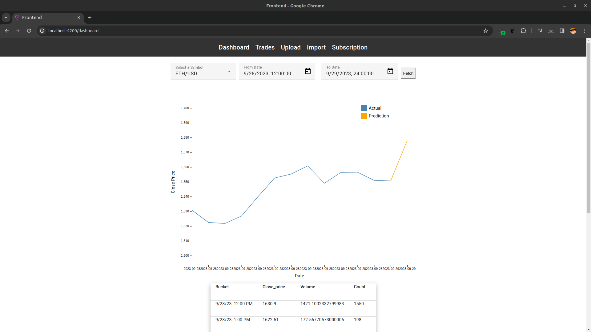

# Kraken LSTM Prediction Engine

_Built as a personal research and engineering challenge to combine ML, streaming data, and modern backend design in a unified system._

**A comprehensive, containerized framework for time-series cryptocurrency price prediction, integrating real-time market data from the Kraken exchange, MLOps tooling, and a multi-language infrastructure.**

---

## Table of Contents

- [Overview](#overview)
- [Key Components & Features](#key-components--features)
- [Web Interface](#web-interface)
- [How to Launch](#how-to-launch)
- [Service Interfaces](#service-interfaces)
- [MLOps Components](#mlops-components-details)
- [Retrospective](#retrospective)
  - [Project Management Notes](#project-management-notes--scope-exploration-and-control)
  - [Workflow Notes](#model-development-workflow-notes)
  - [Debugging Lessons](#debugging-lessons)
  - [What Went Well](#what-went-well)
  - [Rust Backend Adoption](#rust-backend-adoption)

---

## Overview

The Kraken Prediction Engine is a full-stack solution designed to forecast hourly closing prices of cryptocurrencies. This framework combines comprehensive data analysis with a high-performance technological infrastructure to provide analytical support for traders and investors.

### Key Components & Features:

- Prediction Model: At the core is a finely-tuned Long Short-Term Memory (LSTM) neural network, enriched with traditional financial indicators, specifically trained to infer hourly closing prices.

- Data Pipeline: Operates a continuous process of collecting, pre-processing, and analyzing real-time market data from the Kraken crypto exchange API. Data is structured into OHLC (Open, High, Low, Close) prices, volume, and trade count metrics.

- Persistent Storage: Utilizes TimescaleDB (based on PostgreSQL) for efficient time-series data storage and retrieval.

- MLOps Tooling: MLflow provides rigorous tracking of model metrics, hyperparameters, and architectures, ensuring continuous refinement.

- Artifact Storage: MinIO offers a scalable, secure object storage solution for hosting trained model files (artifacts).

- High-Performance Architecture: The backend utilizes Rust for data processing and high performance, integrated with a Python-based web server for model execution and deployment.

- User Interface: A user-friendly frontend provides intuitive access to analytical insights and predictions for traders and investors.

## Web Interface

The frontend provides an interactive dashboard for accessing the prediction engine's output and incoming data streams. It also allows the user to import historical data or add new symbols to the data collection system.



## How to Launch

This project uses Docker and `docker compose` to manage its microservices. Ensure you have **Docker** and **Docker Compose** installed before proceeding.

### Prerequisites

The configuration template is included in the repository and includes the login credentials for some of the services (`config.env`).

### 1. Build and Launch (First Time Setup)

Use this command to **build** the Docker images from their respective Dockerfiles and then **start** all services. This takes place at the root of the project where the `docker-compose.yaml` is located.

```bash
docker compose --env-file config.env up --build
```

### 2\. Launch (Subsequent Use)

If the images have already been built, use this command to quickly start all services.

```bash
docker compose --env-file config.env up
```

### 3\. Stop Services

To stop and remove the containers, networks, and volumes:

```bash
docker compose --env-file config.env down
```

## Service Interfaces

The following services are available via your web browser once the stack is running:

| Service      | Purpose                                            | URL                                                          | Default Credentials                                           |
| :----------- | :------------------------------------------------- | :----------------------------------------------------------- | :------------------------------------------------------------ |
| **Frontend** | Application dashboard & visualization              | [http://127.0.0.1:4200](http://127.0.0.1:4200)               | N/A                                                           |
| **MLflow**   | Track experiments, models, and parameters          | [http://127.0.0.1:5000](http://127.0.0.1:5000)               | N/A                                                           |
| **pgAdmin**  | PostgreSQL database management interface           | [http://127.0.0.1:5050](http://127.0.0.1:5050)               | **User:** `some@email`<br>**Password:** `password`            |
| **MinIO**    | S3-compatible object storage (for model artifacts) | [http://172.1.0.12:2001/login](http://172.1.0.12:2001/login) | **User:** `minio_root_user`<br>**Password:** `minio_password` |

## MLOps Components Details

### MLflow

MLflow is used to **track experiments** (different model runs, hyperparameters, and metrics). It provides a central registry for managing the model lifecycle.

### MinIO (Object Store)

MinIO serves as the secure, high-performance **object storage** layer. It is used for:

- Storing **model artifacts** (e.g., `.pkl` files) tracked by MLflow.
- Used by the model service to fetch the required model files for inference.

## Retrospective

The framework has room for continued optimization, but already provides a solid foundation for advancing cryptocurrency price prediction models and experimentation.

### Project Management Notes — Scope Exploration and Control

Curiosity-driven exploration expanded the project scope as additional features were prototyped to push the framework’s capabilities. While these improvements added value, this highlighted the importance of establishing clear milestone boundaries early, and sequencing exploratory work after core deliverables.

### Model Development Workflow Notes

- Data Pipeline Enhancement
  Dataset extraction currently relies on manual or semi-manual steps in pgAdmin. Future iterations will streamline experimentation by querying the database directly from the notebook environment.

- Model Serving Path
  Inference currently runs on a dedicated Python service. Future refinement may involve (a) MLflow model serving for simplicity, or (b) Rust-native inference for maximum performance and reduced cross-language overhead.

- Post-Deployment Monitoring
  While MLflow is used for experiment tracking, extending it for drift detection and real-time performance monitoring will enable retraining triggers and operational alerts.

### Debugging Lessons

An elusive performance bottleneck was ultimately traced to a tight loop in the Kraken WebSocket data collector monopolizing CPU resources. This reinforced the value of early instrumentation and validating system-level performance assumptions before deeper architectural debugging.

### Docker Networking Optimization

The architecture initially relied on hard-coded container IPs, which worked but created brittle network dependencies. A more sustainable approach would be to use Docker’s automatic DNS-based service discovery (container hostnames), allowing services to communicate reliably without manual IP management. This would improve portability, reduce configuration overhead, and eliminate the need to maintain static IP assignments across environments.

### What Went Well

Established a modular experimental pipeline integrating streaming data ingestion, experiment tracking, and deployable inference - creating a scalable foundation for future work.

### Rust Backend Adoption

This project was my first substantial experience building a backend in Rust. The learning curve required extra time at points, but stepping outside my comfort zone allowed me to develop confidence with async Rust, Axum, Tokio, and performance-oriented system design - skills I had been wanting to explore for a long time.
